# 🏗️ Architecture Documentation

> **SIH-26142 — Satellite Imagery Super-Resolution & Land Cover Analysis**
>
> This document provides a complete architectural reference for the project — covering system design, model architectures, API structure, data flow, frontend state management, and deployment topology. All explanations are accompanied by diagrams, flowcharts, and visual references.

---

## Table of Contents

1. [Project Overview](#1-project-overview)
2. [Directory Structure](#2-directory-structure)
3. [System Architecture](#3-system-architecture)
4. [Backend Architecture](#4-backend-architecture)
   - [API Endpoints](#41-api-endpoints)
   - [Request / Response Contracts](#42-request--response-contracts)
   - [Startup Lifecycle](#43-startup-lifecycle)
5. [Model Architectures](#5-model-architectures)
   - [RCAN (Super-Resolution)](#51-rcan--residual-channel-attention-network)
   - [SegFormer-B2 (Segmentation)](#52-segformer-b2--semantic-segmentation)
6. [Inference Pipelines](#6-inference-pipelines)
   - [SR Inference Pipeline](#61-sr-inference-pipeline)
   - [Segmentation Inference Pipeline](#62-segmentation-inference-pipeline)
   - [End-to-End Data Flow](#63-end-to-end-data-flow)
7. [Frontend Architecture](#7-frontend-architecture)
   - [Component Hierarchy](#71-component-hierarchy)
   - [UI State Machine](#72-ui-state-machine)
   - [Viewer System](#73-viewer-system)
   - [Segmentation UI](#74-segmentation-ui)
8. [Design System](#8-design-system)
9. [Deployment Architecture](#9-deployment-architecture)
10. [Technology Stack](#10-technology-stack)

---

## 1. Project Overview

This application provides an end-to-end pipeline for **satellite image super-resolution** followed by **semantic land cover segmentation**. A user uploads a low-resolution satellite image through a web interface. The backend upscales it to 4× resolution using a custom RCAN neural network, then runs land cover classification using a pretrained SegFormer-B2 model. Results are displayed in a dual-viewer comparison interface with segmentation analytics.

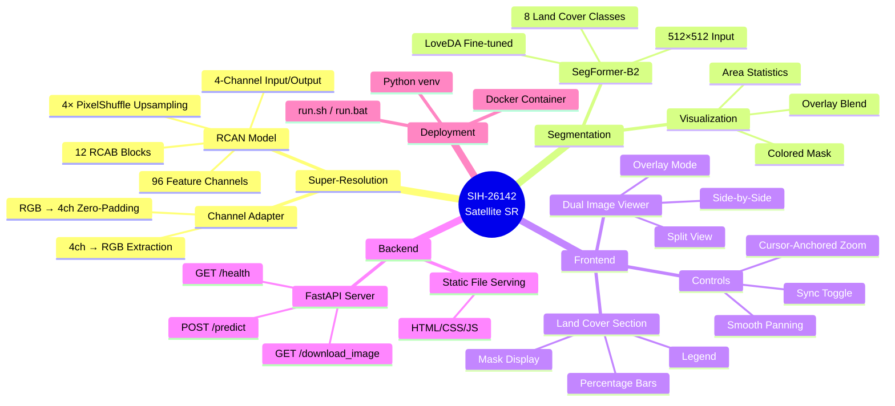

---

## 2. Directory Structure

```text
SIH--26142-Satellite-imagery-Super-Scaling/
│
├── 📄 Dockerfile                    # Single-container Docker build
├── 📄 requirements.txt             # Python dependencies (PyTorch, FastAPI, transformers)
├── 📄 run.sh                       # Linux launcher (Docker or venv)
├── 📄 run.bat                      # Windows launcher (Docker or venv)
├── 📄 README.md                    # Project documentation
├── 📄 architecture.md              # ← This file
├── 📄 .dockerignore                # Docker build exclusions
├── 📄 .gitignore                   # Git exclusions
│
├── 📁 backend/                      # FastAPI application
│   ├── 📄 main.py                  # App entry point, routes, startup
│   ├── 📄 inference.py             # SR inference pipeline + channel adapter
│   └── 📄 model.py                 # RCAN architecture definition (PyTorch)
│
├── 📁 frontend/                     # Vanilla JS/HTML/CSS SPA
│   ├── 📄 index.html               # Main HTML structure
│   ├── 📄 app.js                   # Application logic, viewer, API calls
│   └── 📄 style.css                # Design system, layout, animations
│
├── 📁 model/                        # Trained model weights
│   ├── 📄 rcan_improved.pth        # RCAN checkpoint (~10.6 MB, ~2.78M params)
│   └── 📁 segmentation/            # SegFormer-B2 (LoveDA)
│       ├── 📄 config.json          # HuggingFace model config
│       ├── 📄 preprocessor_config.json  # Input preprocessing spec
│       ├── 📄 pytorch_model.bin    # SegFormer weights (~104 MB)
│       ├── 📄 config.py            # Class labels, color palette, constants
│       ├── 📄 seg_model.py         # Model loading utility
│       ├── 📄 inference.py         # Segmentation pipeline (predict → visualize → stats)
│       └── 📄 __init__.py          # Module marker
│
├── 📁 notebooks/                    # Development notebooks (not used in production)
│   ├── 📄 sih-rcan.ipynb           # RCAN training/evaluation notebook
│   └── 📄 sihValAss.ipynb          # Validation assessment notebook
│
├── 📄 segment.ipynb                 # Verified segmentation inference notebook
│
└── 📁 temp_outputs/                 # Runtime SR output storage (auto-created)
```

---

## 3. System Architecture

### High-Level System Diagram

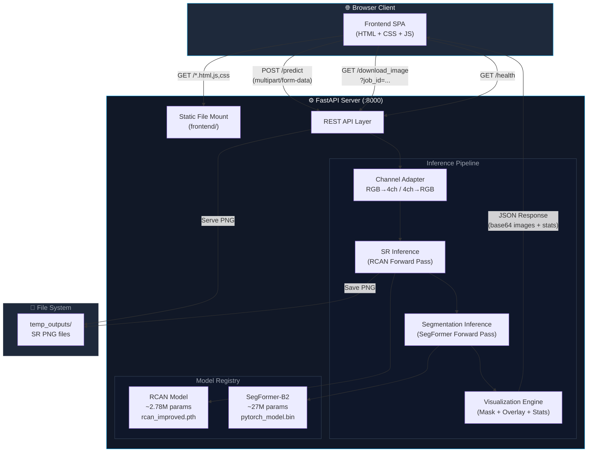

### Single-Server Architecture

The entire application runs as a **single FastAPI process** serving both the API and the static frontend. There is no reverse proxy, no message queue, and no separate frontend server. This simplicity is intentional — the application is designed for direct deployment via Docker or a Python virtual environment.

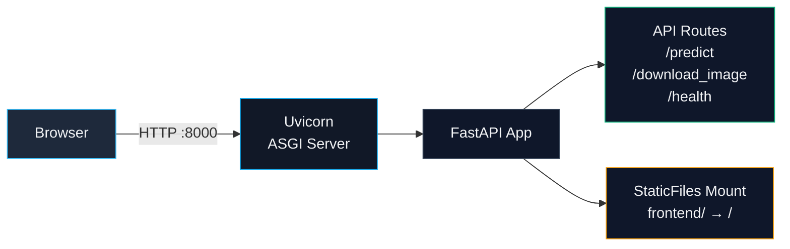

---

## 4. Backend Architecture

### 4.1 API Endpoints

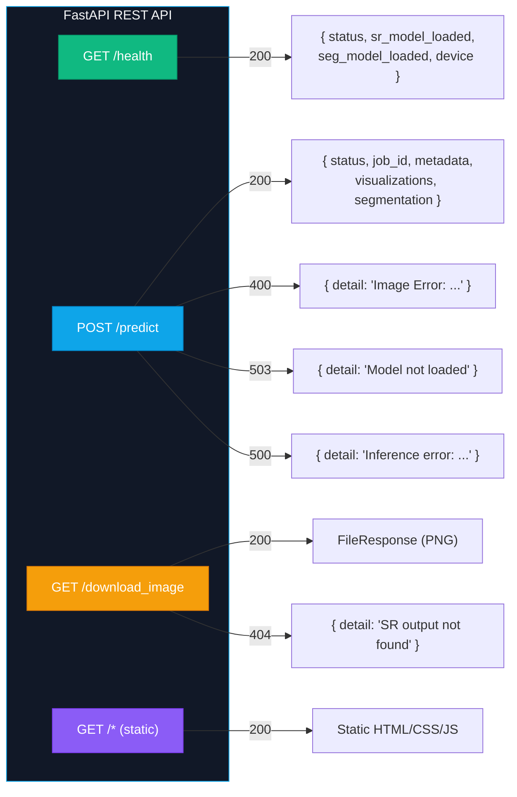

| Method | Path | Purpose | Auth | Body |
|--------|------|---------|------|------|
| `GET` | `/health` | Health check — reports model load status and device | None | — |
| `POST` | `/predict` | Upload LR image → SR + Segmentation pipeline | None | `multipart/form-data` (`lr_file`) |
| `GET` | `/download_image?job_id=<uuid>` | Download full-resolution SR PNG | None | — |
| `GET` | `/*` | Static file serving (frontend SPA) | None | — |

### 4.2 Request / Response Contracts

#### `POST /predict` — Request

```text
Content-Type: multipart/form-data

┌──────────────────────────────────┐
│  Field: lr_file                  │
│  Type:  UploadFile (binary)      │
│  Accepts: .png, .jpg, .jpeg      │
└──────────────────────────────────┘
```

#### `POST /predict` — Response

```json
{
  "status": "success",
  "job_id": "8e28520c-405f-4f7c-8c97-e37067f883c1",
  "metadata": {
    "input": {
      "filename": "satellite_tile.png",
      "width": 128,
      "height": 128,
      "channels": 3,
      "size_bytes": 45120,
      "format": "PNG"
    },
    "output": {
      "width": 512,
      "height": 512,
      "channels": 3,
      "scale_factor": 4,
      "format": "PNG"
    }
  },
  "visualizations": {
    "lr_rgb": "<base64 PNG>",
    "sr_rgb": "<base64 PNG>"
  },
  "segmentation": {
    "available": true,
    "mask": "<base64 PNG — colored class mask>",
    "overlay": "<base64 PNG — blended SR + mask>",
    "classes": [
      { "class_id": 6, "label": "Forest", "color": "#00b400", "percentage": 42.15 },
      { "class_id": 7, "label": "Agricultural", "color": "#ffb400", "percentage": 28.73 },
      { "class_id": 1, "label": "Background", "color": "#1e1e1e", "percentage": 15.02 },
      { "class_id": 2, "label": "Building", "color": "#ff0000", "percentage": 8.44 },
      { "class_id": 3, "label": "Road", "color": "#ffff00", "percentage": 3.21 },
      { "class_id": 4, "label": "Water", "color": "#0078ff", "percentage": 1.85 },
      { "class_id": 5, "label": "Barren", "color": "#b4783c", "percentage": 0.60 }
    ]
  }
}
```

### 4.3 Startup Lifecycle

```mermaid
sequenceDiagram
    participant UV as Uvicorn
    participant FA as FastAPI
    participant SR as RCAN Loader
    participant SEG as SegFormer Loader
    participant FS as File System

    UV->>FA: Start ASGI Application
    FA->>FA: @app.on_event("startup")
    
    rect rgb(15, 23, 42)
        Note over FA,SR: SR Model Loading (Required)
        FA->>FS: Check MODEL_PATH exists
        FS-->>FA: ✓ rcan_improved.pth found
        FA->>SR: load_model(path, device)
        SR->>SR: torch.load(checkpoint)
        SR->>SR: RCAN(num_blocks=12, channels=96)
        SR->>SR: model.load_state_dict()
        SR->>SR: model.eval()
        SR-->>FA: (model, device, normalization)
        FA->>FA: MODEL = model ✓
    end

    rect rgb(15, 23, 42)
        Note over FA,SEG: Segmentation Model Loading (Optional)
        FA->>SEG: load_segmentation_model(device)
        SEG->>SEG: SegformerForSemanticSegmentation.from_pretrained()
        SEG->>SEG: model.eval()
        SEG-->>FA: (model, device)
        FA->>FA: SEG_MODEL = model ✓
    end

    Note over FA: If SEG fails → SEG_MODEL = None<br/>SR pipeline still works

    FA-->>UV: Application startup complete
    UV->>UV: Listening on 0.0.0.0:8000
```

> [!IMPORTANT]
> **Fault Isolation:** Segmentation model loading is wrapped in a `try/except`. If it fails (e.g., missing weights, incompatible transformers version), the SR pipeline continues to function normally. The `/predict` response will include `"segmentation": { "available": false, "error": "..." }`.

---

## 5. Model Architectures

### 5.1 RCAN — Residual Channel Attention Network

The super-resolution model is a custom **RCAN** (Residual Channel Attention Network) originally trained on Sentinel-2 satellite imagery with 4 spectral bands. It achieves **4× spatial upscaling**.

#### Architecture Diagram

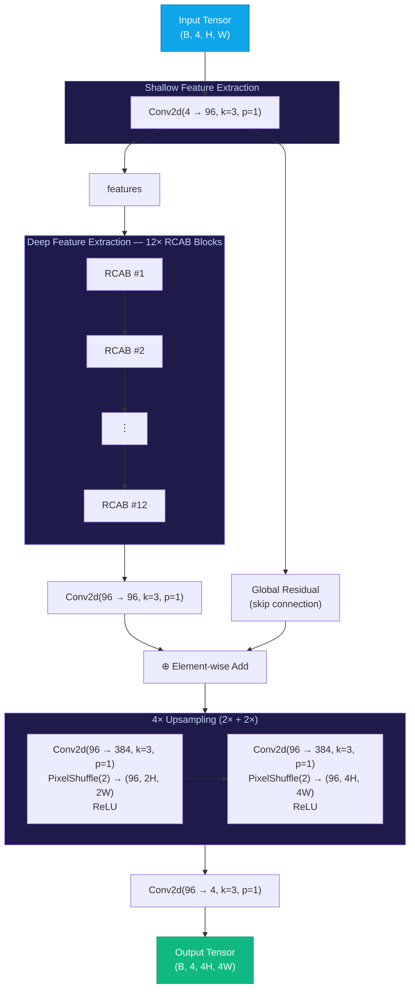

#### RCAB Block Detail

Each **Residual Channel Attention Block (RCAB)** combines local feature extraction with a squeeze-and-excitation style channel attention mechanism:

```mermaid
graph LR
    X["Input<br/>(96 ch)"] --> CONV1["Conv2d(96→96, k=3)"]
    CONV1 --> RELU["ReLU"]
    RELU --> CONV2["Conv2d(96→96, k=3)"]
    
    CONV2 --> GAP["AdaptiveAvgPool2d(1)<br/>Global Average Pooling"]
    GAP --> ATT1["Conv2d(96→12, k=1)<br/>Squeeze (÷8)"]
    ATT1 --> RELU2["ReLU"]
    RELU2 --> ATT2["Conv2d(12→96, k=1)<br/>Excitation"]
    ATT2 --> SIG["Sigmoid"]
    
    CONV2 --> MUL["⊗ Channel Attention"]
    SIG --> MUL
    
    MUL --> SCALE["× 0.1<br/>Residual Scaling"]
    SCALE --> ADD["⊕ Skip Connection"]
    X --> ADD
    ADD --> OUT["Output<br/>(96 ch)"]

    style X fill:#1e293b,stroke:#38bdf8,color:#f3f4f6
    style OUT fill:#1e293b,stroke:#10b981,color:#f3f4f6
    style SCALE fill:#7c2d12,stroke:#ea580c,color:#fed7aa
```

#### Key Specifications

| Parameter | Value |
|-----------|-------|
| Input channels | 4 (RGB + zero-padded 4th channel) |
| Output channels | 4 (first 3 extracted as RGB) |
| Feature channels | 96 |
| RCAB blocks | 12 |
| Attention reduction ratio | 8 (96 → 12 → 96) |
| Residual scaling factor | 0.1 |
| Upscaling method | 2× PixelShuffle × 2 stages = 4× total |
| Total parameters | ~2,776,276 (~2.78M) |
| Checkpoint size | ~10.6 MB |
| Normalization | Input ÷ 255.0, Output clamp [0, 1] × 255 |

---

### 5.2 SegFormer-B2 — Semantic Segmentation

The segmentation model is a **SegFormer-B2** pretrained on ImageNet and fine-tuned on the **LoveDA** dataset for land cover classification. It is loaded from local weights via HuggingFace `transformers`.

#### Architecture Overview

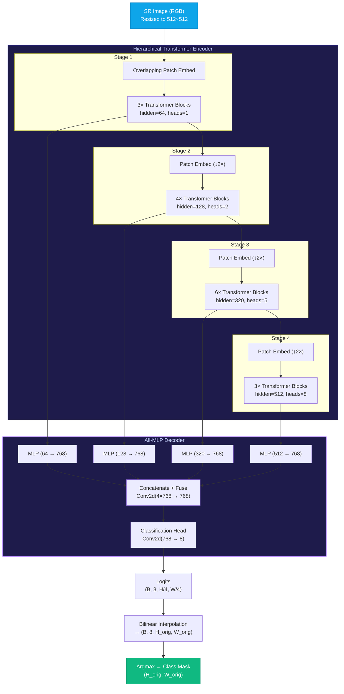

#### Land Cover Classes

| Class ID | Label | Color | Hex |
|----------|-------|-------|-----|
| 0 | Ignore | ⬛ Black | `#000000` |
| 1 | Background | ⬛ Dark Gray | `#1e1e1e` |
| 2 | Building | 🟥 Red | `#ff0000` |
| 3 | Road | 🟨 Yellow | `#ffff00` |
| 4 | Water | 🟦 Blue | `#0078ff` |
| 5 | Barren | 🟫 Brown | `#b4783c` |
| 6 | Forest | 🟩 Green | `#00b400` |
| 7 | Agricultural | 🟧 Orange | `#ffb400` |

#### Key Specifications

| Parameter | Value |
|-----------|-------|
| Architecture | SegFormer-B2 (Mix Transformer) |
| Training data | LoveDA (urban + rural land cover) |
| Input size | 512 × 512 (resized) |
| Normalization | ImageNet mean/std |
| Encoder stages | 4 (depths: 3, 4, 6, 3) |
| Hidden sizes | 64, 128, 320, 512 |
| Attention heads | 1, 2, 5, 8 |
| Decoder hidden | 768 |
| Output classes | 8 (including Ignore) |
| Parameters | ~27M |
| Checkpoint size | ~104 MB |

---

## 6. Inference Pipelines

### 6.1 SR Inference Pipeline

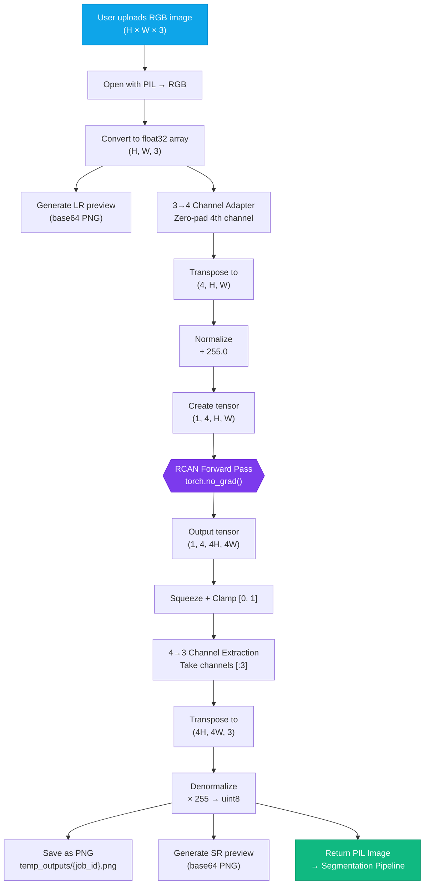

> [!NOTE]
> **Channel Adapter Rationale:** The RCAN model was trained on 4-band Sentinel-2 imagery (Blue, Green, Red, NIR). For standard RGB input, the 4th channel is zero-padded before inference. After inference, only the first 3 output channels are extracted as the final RGB result. The model weights are never modified.

### 6.2 Segmentation Inference Pipeline

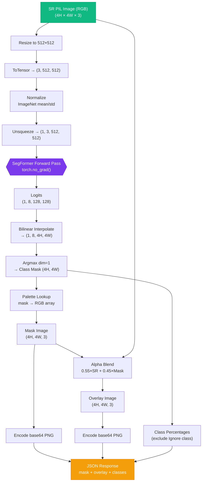

### 6.3 End-to-End Data Flow

```mermaid
sequenceDiagram
    participant B as Browser
    participant F as FastAPI
    participant SR as RCAN Model
    participant SEG as SegFormer Model
    participant FS as File System

    B->>F: POST /predict (multipart: lr_file)
    
    rect rgb(15, 23, 42)
        Note over F: Save upload to temp file
        F->>FS: Write upload to temp_outputs/upload_<name>
    end

    rect rgb(30, 58, 95)
        Note over F,SR: Super-Resolution Pipeline
        F->>F: PIL.open() → RGB
        F->>F: 3→4 Channel Adapter (zero-pad)
        F->>F: Normalize (÷255), create tensor
        F->>SR: model(input_tensor)
        SR-->>F: output_tensor (1, 4, 4H, 4W)
        F->>F: 4→3 Channel Extraction
        F->>F: Clamp, denormalize → uint8
        F->>FS: Save SR PNG (temp_outputs/{job_id}.png)
        F->>F: Generate base64 previews
    end

    rect rgb(30, 40, 80)
        Note over F,SEG: Segmentation Pipeline (if model loaded)
        F->>F: Resize SR image → 512×512
        F->>F: Normalize (ImageNet stats)
        F->>SEG: model(pixel_values)
        SEG-->>F: logits (1, 8, 128, 128)
        F->>F: Interpolate → original SR size
        F->>F: Argmax → class mask
        F->>F: Apply color palette → mask image
        F->>F: Alpha blend → overlay image
        F->>F: Calculate class percentages
        F->>F: Encode mask + overlay as base64
    end

    rect rgb(15, 23, 42)
        Note over F: Cleanup
        F->>FS: Delete uploaded temp file
    end

    F-->>B: JSON { status, job_id, metadata,<br/>visualizations, segmentation }

    Note over B: User clicks Download
    B->>F: GET /download_image?job_id=<uuid>
    F->>FS: Read temp_outputs/{job_id}.png
    F-->>B: FileResponse (PNG binary)
```

---

## 7. Frontend Architecture

### 7.1 Component Hierarchy

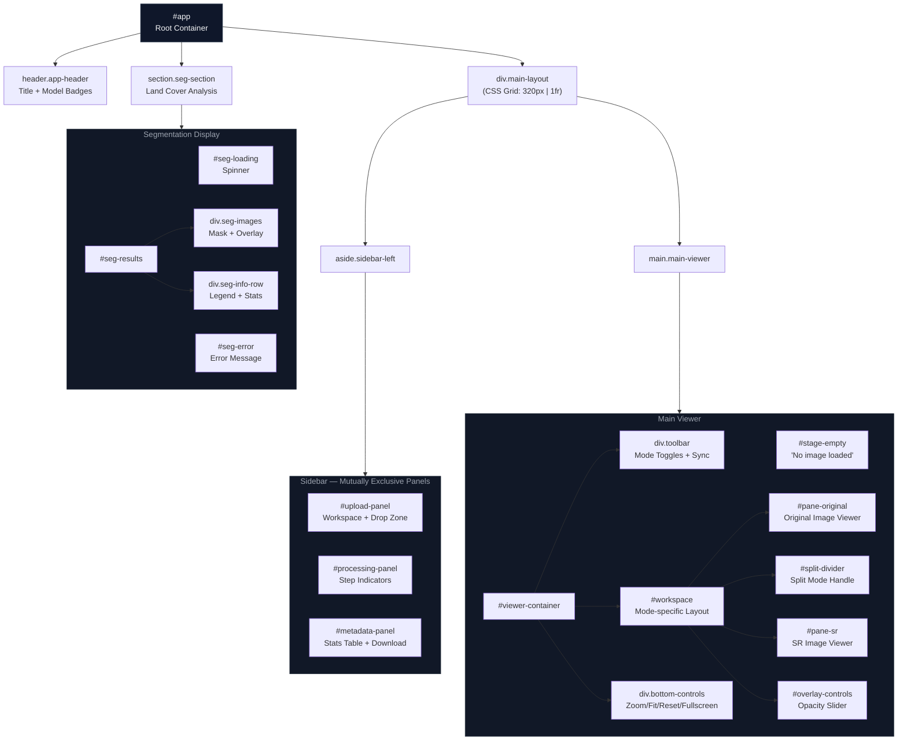

### 7.2 UI State Machine

The application follows a linear state machine. The sidebar panels are **mutually exclusive** — only one is visible at a time.

```mermaid
stateDiagram-v2
    [*] --> IDLE: Page Load

    state IDLE {
        note right of IDLE
            • upload-panel: VISIBLE
            • processing-panel: HIDDEN
            • metadata-panel: HIDDEN
            • stage-empty: VISIBLE
            • viewer-container: HIDDEN
            • segmentation-section: HIDDEN
            • start-btn: DISABLED
        end note
    }

    IDLE --> FILE_SELECTED: User drops/selects image

    state FILE_SELECTED {
        note right of FILE_SELECTED
            • Upload zone shows filename
            • start-btn: ENABLED
            • Local preview loaded into viewers
            • viewer-container: VISIBLE
            • stage-empty: HIDDEN
            • Images fit to screen
        end note
    }

    FILE_SELECTED --> PROCESSING: Click "Start Super-Resolution"

    state PROCESSING {
        note right of PROCESSING
            • upload-panel: HIDDEN
            • processing-panel: VISIBLE
            • Steps animate sequentially:
              1. Analyzing Input (active → done)
              2. Running Super-Resolution (active → done)
              3. Generating Result (active → done)
        end note
    }

    PROCESSING --> RESULTS: API returns successfully

    state RESULTS {
        note right of RESULTS
            • processing-panel: HIDDEN
            • metadata-panel: VISIBLE
            • SR image loaded into viewer
            • Stats table populated
            • segmentation-section: VISIBLE
            • Mask, overlay, legend, stats populated
            • Auto-scroll to segmentation
        end note
    }

    PROCESSING --> ERROR: API error / network failure

    state ERROR {
        note right of ERROR
            • Alert displayed
            • Page reloads → back to IDLE
        end note
    }

    ERROR --> IDLE: location.reload()
```

### 7.3 Viewer System

The image comparison workspace supports three modes. The viewer uses **CSS transforms** (`translate` + `scale`) with `transform-origin: 0 0` for hardware-accelerated rendering.

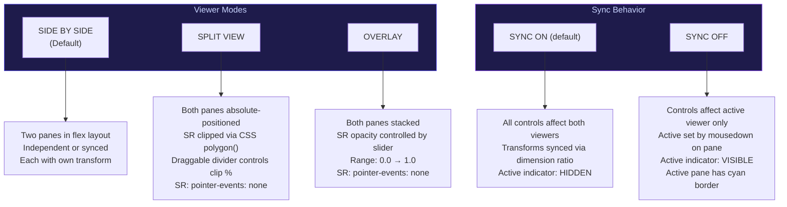

#### Zoom Mathematics

Cursor-anchored zoom ensures the point under the cursor stays fixed during zoom:

$$\text{panX}_{\text{new}} = x - (x - \text{panX}_{\text{old}}) \times \frac{\text{scale}_{\text{new}}}{\text{scale}_{\text{old}}}$$

$$\text{panY}_{\text{new}} = y - (y - \text{panY}_{\text{old}}) \times \frac{\text{scale}_{\text{new}}}{\text{scale}_{\text{old}}}$$

Where $(x, y)$ is the cursor position relative to the pane's bounding rect.

#### Sync Transform Calculation

When syncing two viewers with different native resolutions (e.g., Original 128×128 and SR 512×512):

$$\text{scale}_{\text{dest}} = \text{scale}_{\text{source}} \times \frac{1}{\text{ratio}_W}$$

Where $\text{ratio}_W = \frac{W_{\text{dest}}}{W_{\text{source}}}$. Pan coordinates are identical because the transform is applied in screen-space.

### 7.4 Segmentation UI

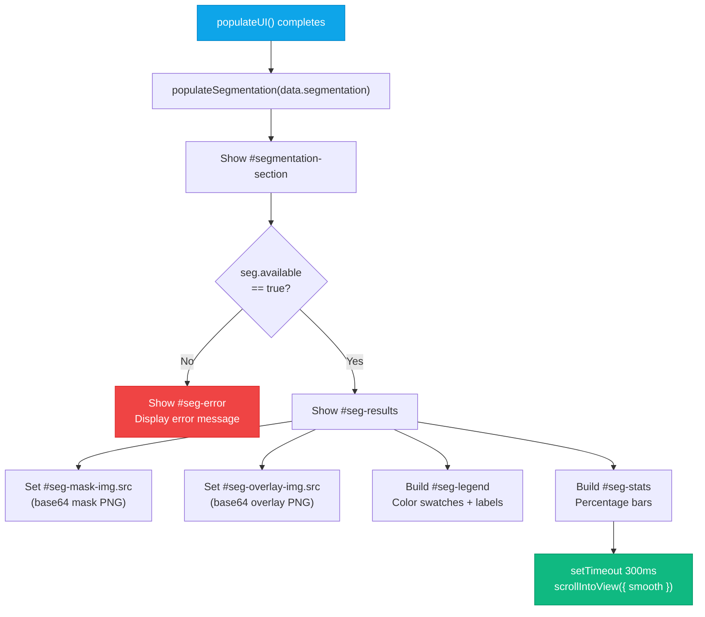

---

## 8. Design System

### Color Tokens

```mermaid
graph LR
    subgraph PALETTE["CSS Custom Properties (:root)"]
        direction TB
        BG["--bg-color<br/>#0b0f19"]
        PANEL["--panel-bg<br/>#111827"]
        BORDER["--border-color<br/>#1f2937"]
        TEXT1["--text-primary<br/>#f3f4f6"]
        TEXT2["--text-secondary<br/>#9ca3af"]
        ACCENT["--accent-color<br/>#0ea5e9"]
        HOVER["--accent-hover<br/>#38bdf8"]
        DANGER["--danger<br/>#ef4444"]
        SUCCESS["--success<br/>#10b981"]
    end

    style BG fill:#0b0f19,stroke:#1f2937,color:#f3f4f6
    style PANEL fill:#111827,stroke:#1f2937,color:#f3f4f6
    style BORDER fill:#1f2937,stroke:#374151,color:#f3f4f6
    style TEXT1 fill:#f3f4f6,stroke:#d1d5db,color:#111827
    style TEXT2 fill:#9ca3af,stroke:#6b7280,color:#111827
    style ACCENT fill:#0ea5e9,stroke:#0284c7,color:#fff
    style HOVER fill:#38bdf8,stroke:#0ea5e9,color:#111827
    style DANGER fill:#ef4444,stroke:#dc2626,color:#fff
    style SUCCESS fill:#10b981,stroke:#059669,color:#fff
```

### Typography

| Usage | Font | Weights |
|-------|------|---------|
| Body text, headings, labels | **Inter** | 300, 400, 500, 600 |
| Badges, stats, zoom level, monospace data | **JetBrains Mono** | 400, 500 |

### Layout Grid

```text
┌─────────────────────────────────────────────────────────────────┐
│  HEADER (60px fixed height)                                     │
│  [Title + Subtitle]                           [Scale] [Arch]    │
├────────────┬────────────────────────────────────────────────────┤
│            │                                                    │
│  SIDEBAR   │              MAIN VIEWER                          │
│  (320px)   │              (1fr flex)                            │
│            │                                                    │
│  Upload    │   ┌──────────┐   ┌──────────┐                     │
│  Panel     │   │ ORIGINAL │   │    SR    │                     │
│  ─────     │   │          │   │          │                     │
│  Process   │   │          │   │          │                     │
│  Panel     │   └──────────┘   └──────────┘                     │
│  ─────     │                                                    │
│  Metadata  │   [−] 100% [+]  [FIT] [1:1] [RESET] [FULLSCREEN] │
│  Panel     │                                                    │
├────────────┴────────────────────────────────────────────────────┤
│  SEGMENTATION SECTION (full width, scrollable)                  │
│                                                                 │
│  ┌──────────────────┐  ┌──────────────────┐                    │
│  │ Segmentation     │  │ Overlay on       │                    │
│  │ Mask             │  │ SR Image         │                    │
│  └──────────────────┘  └──────────────────┘                    │
│                                                                 │
│  ┌──────────────────┐  ┌──────────────────┐                    │
│  │ Legend           │  │ Area Distribution │                    │
│  │ ■ Building       │  │ Forest    ████ 42%│                    │
│  │ ■ Road           │  │ Agri      ███  29%│                    │
│  │ ■ Water          │  │ Building  ██    8%│                    │
│  └──────────────────┘  └──────────────────┘                    │
└─────────────────────────────────────────────────────────────────┘
```

---

## 9. Deployment Architecture

### Docker Deployment

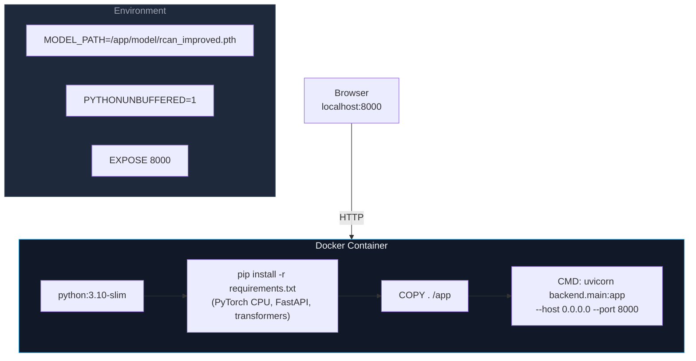

### Launch Options

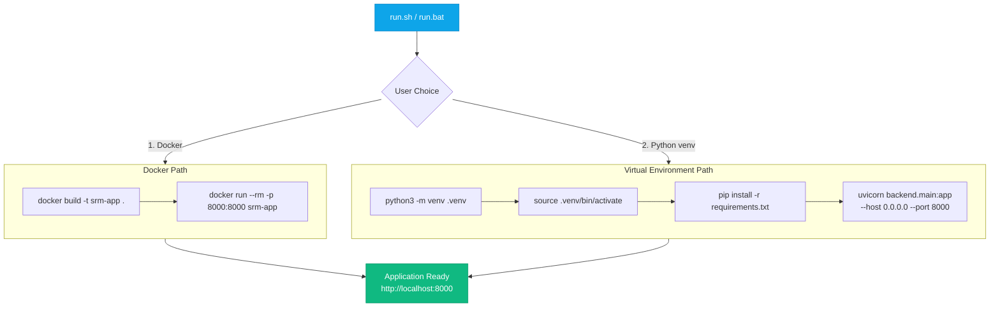

---

## 10. Technology Stack

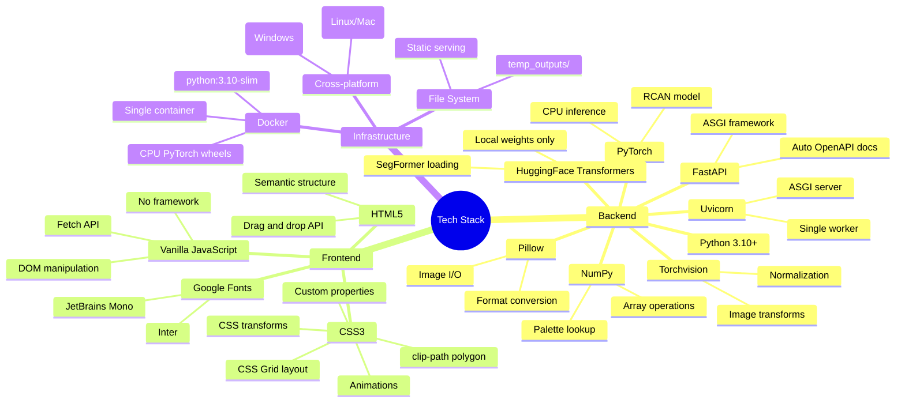

---

> **Document Version:** 1.0
>
> **Last Updated:** September 2026
>
> **Scope:** Read-only architectural reference. This document does not modify any application code or configuration.
